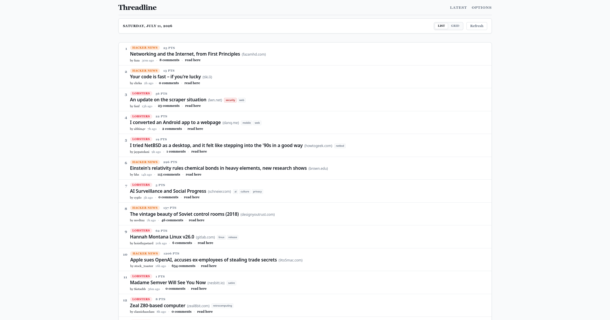
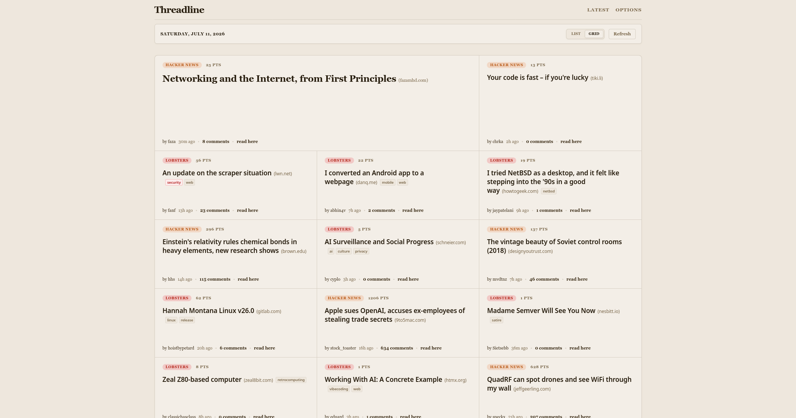
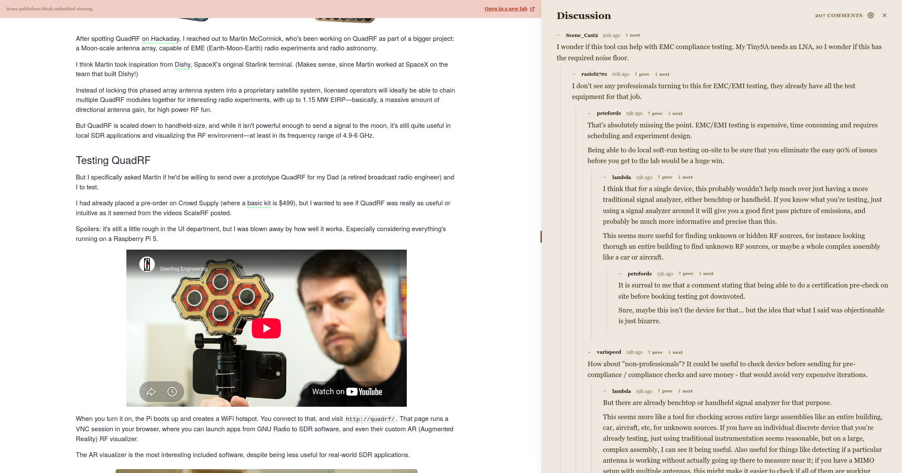

# Threadline

Threadline is a compact, static-first reader for community news. It combines Hacker News and Lobsters into one local, customizable front page with fast feed loading, source filters, discussion reading, and an optional inline article reader on larger screens.

Preferences live in `localStorage`; no account or backend database is required.

## Screenshots

### List layout



### Grid layout, sepia theme



### Inline reader and discussion



## Features

- Combined Hacker News and Lobsters feed
- List and newspaper-style grid layouts
- Light, dark, and sepia themes
- Local source, ranking, domain, and Lobsters tag preferences
- Nested discussion view with collapse and comment navigation
- Inline article reader on desktop/tablet
- Static React app deployable on Cloudflare Pages
- Cloudflare Pages Functions for feed aggregation and Lobsters CORS proxy

## Development

```bash
nix develop
pnpm install
pnpm dev
```

Checks:

```bash
pnpm typecheck
pnpm test
pnpm build
```

